jira,,,

왜 지라인가?! 

1. 이슈트래킹
2. 애자일
3. 데브옵스
4. sre

# 이슈트래킹

투두 리스트 같은 것! 이슈들을,,! 

프로젝트 매니지먼트같은 부분에서 장점이 있음,,,

# 애자일

개발 철학, 문화

문서보다 실제 작동하는 소프트웨어 대응! 일단 만들어 놓고 피드백이 오면 거기서 발전

스크럼, 칸반

둘의 차이, 스프린트!! 스크럼 o, 칸반x(한번에 일정량의 일만)

스크럼의 경우,,,

스크럼 미팅,,! 

# 데브옵스

개발팀과 운영팀이 나누어져 있음,,! 

dev 와 ops가 나누어져있구먼,,! 

애자일 문화를 개발시키다보니, 자연스럽게 데브옵스! 

빨리 개발시키고 배포하자 => 운영해서 다시 오류가 있음면 다시 개발,,

뫼비우스의 띠 

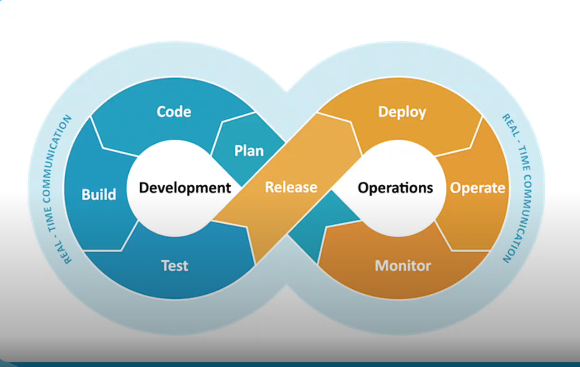

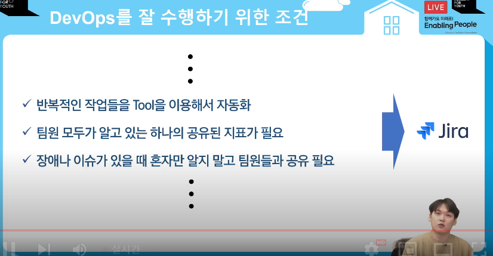

# SRE

SITE 신뢰성 공학

장애에 중점,,! 장애를 발생하지 않고 신뢰성있게 사이트를 하는지! 

----

스토리!? 사용자 중심의 스토리,, 사용자가 회원가입을 한다,, 약간 이런 것들

테스크 ? 개발이외의 할일들,,! 여기도 그냥 개발 할일을 적기도 함

에픽? 진짜 큰틀,, FE, BE로 나누던가,, `분류`라고 봐도 됨

서머리 : 이슈제목

리포터 : 보고자

컴포넌트 : 

픽스버젼 : 버젼

라벨 : 형식을 태그! 자유도가 높은 대신 대소문자 같은거 구분잘해야 함! 

링크드 이슈 : 이슈끼리의 관계?! 

어사이니 : 담당자

애픽링크 : 어떤에픽에 속하는지

스프린트,,! : 스크럼의 스프린트를 말하는 것

---

# jql

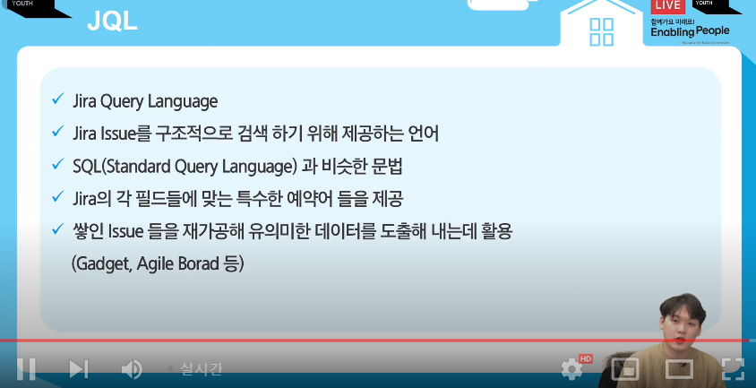

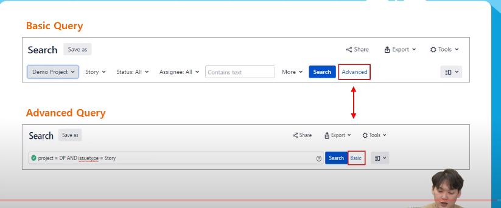

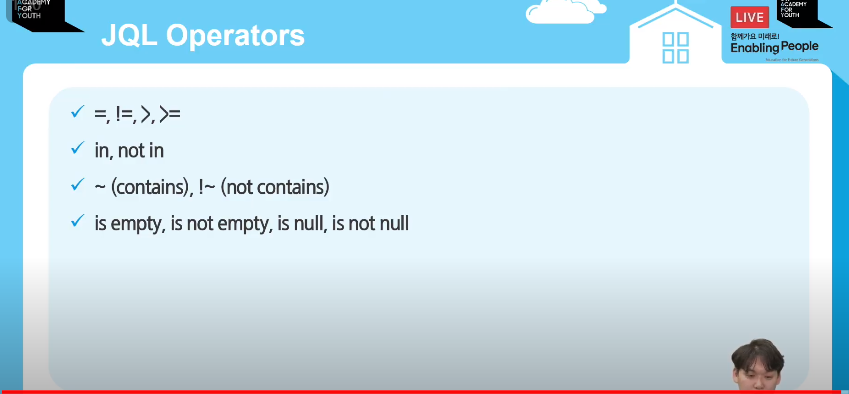

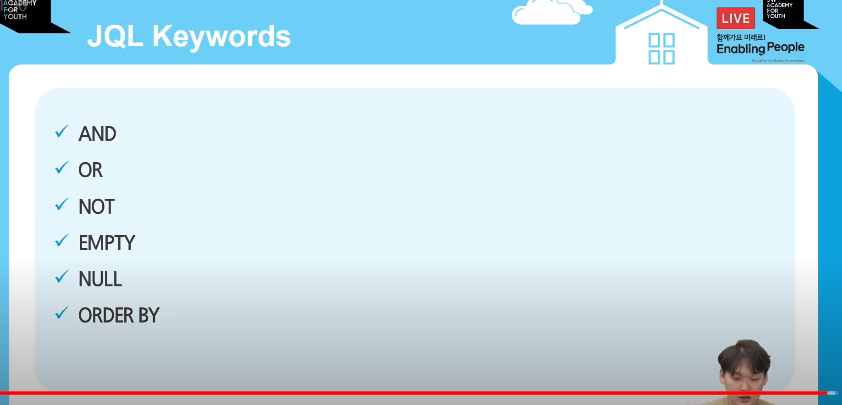

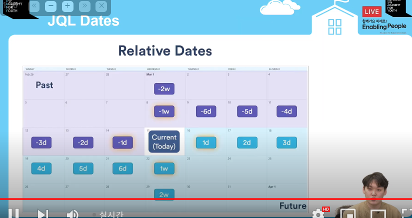

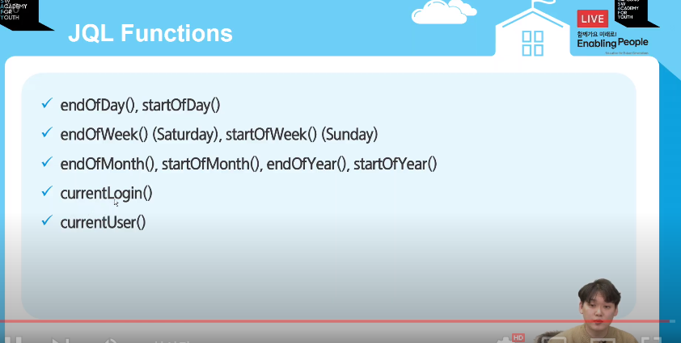

updataed > -2d : 이틀전에 이후에 된것들 다 보여줘! 

updataed > startofweek(1d) 일요일보다 하루 뒤, 즉 월요일, 월요일 이후에 수정된 이슈들

월요일과 금요일 사이? = > updataed > startofweek(1d) AND end fo week(-1d)

내가 담당자인 이슈를 보여줘 assigne = 커렌트유저

save as해서 이번주 이슈 같은 식으로 저장하고 공유도 가능

꼭 add를 눌러야 함

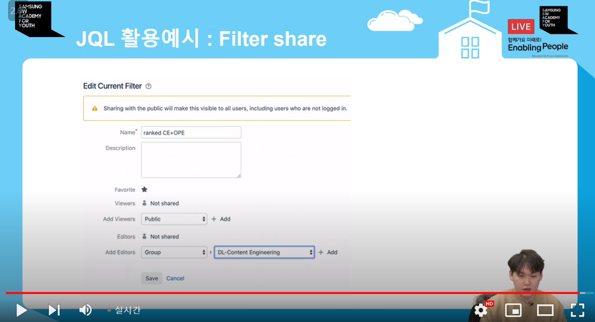

----

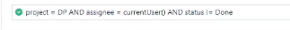

완료 되지 않은 이슈 검색

레졸루션? 내가 이슈를 어떻게 끝냈는지 말을 하는,,

나의 미완료 이슈

---

# 대시보드

만들어서 나한테 맞는 대시보드를 만들 수 있음

가젯을 추가할 수도 있음(어사인드 투미,,,)

필터 리쥴트,,, 필터를 기준으로 ,, 

어사인드 투미 ,, 나에게 할당된,,

대시보드도 공유가 가능! 팀원들이 봤으면 하는 화면?!

---

# 애자일보드

칸반보드, 스크럼보드 등등,,

---

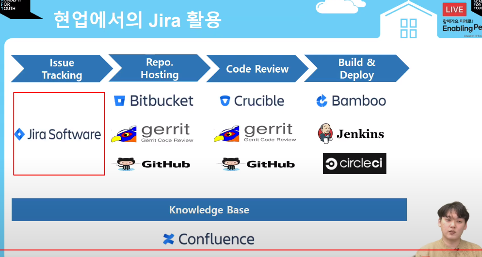

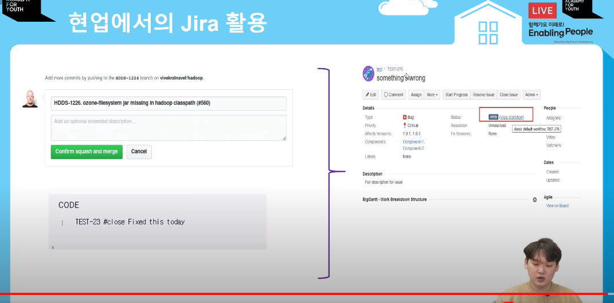

지라와 깃허브를 연결,,, 이슈와 커밋을 연결,,, 

브렌치를 닫으면서 이슈를 같이 끝낸ㄴ,,,!

----

다양한 플러그인이 존재해서, 그걸 구매해서 사용

 플러그인 추천 : jsu 

----

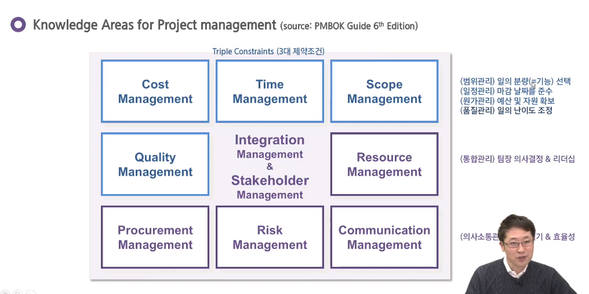

