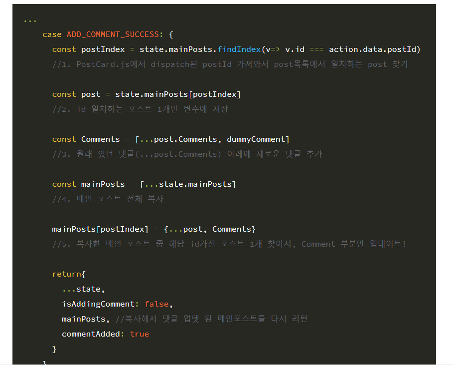
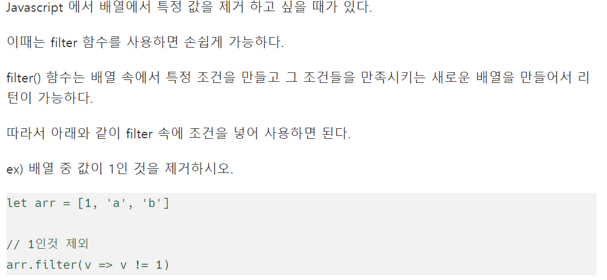

# 어떻게 흘러갈지 시물레이션!

처음부터


로그인폼에소 로그인ㅇ르 할꺼다

아이디 비밀번호 적고 로그인을 누르면

`loginRequestAction`이 dispatch 된다.


그리고 나면


```js
function* watchLogIn() {
  yield takeLatest(LOG_IN_REQUEST, logIn);
}

```


요기에 걸림.. 이벤트 리스너 역활을 하는거 같은 이 부분에서! 


그럼 이 다음에 

```js
function* logIn(action) {
  try {
    console.log('saga logIn');
    // const result = yield call(logInAPI);
    yield delay(1000);
    yield put({
      type: LOG_IN_SUCCESS,
      data: action.data,
    });
  } catch (err) {
    console.error(err);
    yield put({
      type: LOG_IN_FAILURE,
      error: err.response.data,
    });
  }
}
```

요 부분이 실행이 되겟지?!

그와 동시에 실행되는 곳이 한곳 이 있음! 바로 리듀서에도 있음 `스위치`가 실행이 됨!

```js
const reducer = (state = initalState, action) => {
  switch (action.type) {

    case "LOG_IN_REQUEST":
      // return  {
      //   ...state, //처음 initalstate객체 핀것!
      //   user: { 
      //     ...state.user, //user객체 안의 것들이라!!
      //     isLoggedIn: true,
      //     user: action.data
      //   }
      // }
      return  {
        ...state,
          logInLoading: true, 
      }
```

그 다음에 다시 사가의 


```js
function* logIn(action) {
  try {
    console.log('saga logIn');
    // const result = yield call(logInAPI);
    yield delay(1000);
    yield put({
      type: LOG_IN_SUCCESS,
      data: action.data,
    });
  } catch (err) {
    console.error(err);
    yield put({
      type: LOG_IN_FAILURE,
      error: err.response.data,
    });
  }
}
```

요 부분이 실행되겟지! 1초 뒤에  `LOG_IN_SUCCESS,`액션이 디스패치되고

다시 리듀서에서


```js
case "LOG_IN_SUCCESS":
      return  {
          ...state,
          logInLoading: false,
          isLoggedIn: true,
          me: {...action.data, nickname:"jeehwan"} 
      }
```

이 부분이 실행이 됨.

이 순간 `me`에 데이터가 들어간다. `isLoggedIn`도 true가되고 

그렇게 되면 

AppLayout에서

로그임폼을 랜더링 하는게 아니라 유저프로필을 렌더링 함

```js
const AppLayout = ({children}) => {

    	//중앙저장소에서 데이터를 공유하면서! 
  const isLoggedIn = useSelector((state) => state.user.isLoggedIn)
  
  
  <Row gutter={8}>
        <Col xs={24} md={6}>
          {isLoggedIn ? <UserProfile /> : <LoginForm/>}
        </Col>
        <Col xs={24} md={12}>
           {children} 
        </Col>
        <Col xs={24} md={6}>
          <a href='https://velog.io/@meanstrike' target="_blank" rel='noreferrer noopener'>Made by jeehwan</a>
        </Col>
      </Row>
```


---


# 중앙데이터에서 가져오기!


```js
import React, { useCallback } from 'react';
import {Card, Avatar, Button} from "antd"
import {useDispatch, useSelector} from "react-redux"

import {logoutRequestAction} from "../reducers/user"

// eslint-disable-next-line react/prop-types
const UserProfile = () => {

  const dispatch = useDispatch()
  const { me, logOutLoading } = useSelector((state) => state.user)


  const onLogOut = useCallback(() => {
    dispatch(logoutRequestAction())
  })
  return(
    <Card
      actions= {[
        <div key="twit">쨱쨱<br />{me.Posts.length}</div>, 
        <div key="followings">팔로잉<br />{me.Followings.length}</div>, 
        <div key="followers">팔로워<br />{me.Followers.length}</div>
      ]}
      >
        <Card.Meta
          Avatar={<Avatar>{me.nickname[0]}</Avatar>}
          title={me.nickname}
        />
        <Button onClick={onLogOut} loading={logOutLoading} >로그아웃</Button>
    </Card>
  )
}

export default UserProfile


----------------------------------------------------


const dummyUser = (data) => ({
  ...data,
  nickname: '지환주',
  id: 1,
  Posts: [{ id: 1 }],
  Followings: [{ nickname: '부기초' }, { nickname: 'Chanho Lee' }, { nickname: 'neue zeal' }],
  Followers: [{ nickname: '부기초' }, { nickname: 'Chanho Lee' }, { nickname: 'neue zeal' }],
});

case LOG_IN_SUCCESS:
return  {
    ...state,
    logInLoading: false,
    logInDone: true,
    me: dummyUser(action.data)
}

```


---


# useEffect

https://xiubindev.tistory.com/100


----


# 커스텀 활용  <응용>


우리가 만들어 놓은 커스텀 훅! 

````js
import { useState, useCallback } from "react";


export default (initalValue = null) => {

  const [value, setValue] = useState(initalValue)
  const handler = useCallback((e) => {
    setValue(e.target.value)
  }, [])

  return [value, handler]

}
````

근데 return 으로 `value, handler`만을 하네,,! 근데 갑자기 `setValue`가 필요하다면?!


```js
import { useState, useCallback } from "react";


export default (initalValue = null) => {

  const [value, setValue] = useState(initalValue)
  const handler = useCallback((e) => {
    setValue(e.target.value)
  }, [])

  return [value, handler,setValue]

}
```

긔냥 이거 하나 추가해서 사용하면 된다! 헤헷 별거 아님! 


그리고 사용 하는 코드


```js
  const [commentText, onChangeCommentText, setCommentText] = useInput('');

  useEffect(() => {
    if (addCommentDone) {
      setCommentText('');
    }
  }, [addCommentDone]);
```


----


불변성의 핵심,,! 

바뀌는 것만 새로운 객체로 만들고, 그 이외의 것들은 참조를 유지!(메모리를 절약)




```js
 case ADD_COMMENT_SUCCESS: {

      const postIndex = state.mainPosts.findIndex((v) => v.id === action.data.postId)
      //1. postCard.js에서 dispatch된 postId 가져와서 post목록에서 일치하는 post찾기 
      const post = {...state.mainPosts[postIndex]}
      //2. id 일치하는 포스트 1개만 변수에 저장
      post.Comments = [dummyComment(action.data.content), ...post.Comments]
     //3. 원래 있던 댓글 (...post.Comments) 아래에 새로운 댓글 추가
      const mainPosts = [...state.mainPosts]
      //4. 메인 포스트 전체 복사
      mainPosts[postIndex] = post

        return {
          ...state,
          //더미 포스트가 앞에 있어야 최신글이 위로! 
          //기존에 있던 게시글들도 있어야 하잖아! 그래서 ...state.main
          mainPosts,
          addCommentLoading: false, 
          addCommentDone: true, 
        }
     
    }
```

이렇게 하면 불변성을 지킬 수 있는데! 참으로 힘듬! 그래서 사용하는게 `immer`라는 라이브러리! 


----


# TIP

객체 내에서 {}


이름이랑 값이 값으면 생략가능!


```js
 const id = shortId.generate()

 data: {
        id, 
        content:action.data
      }
```


----


# Tip 게시글 삭제 / 추가 를 통해 팔로우 팔로워 정보 변경


=> 상태는 액션을 통해서만 변해! 액션을 만들면 된다! 

## 포스트 사가에서 유저 액션을 호출 할 수 있음


saga는 동시에 여러 액션ㄴ을 디스패치 할 수 있음

만약에 어 떤 액션이 여러 리듀서의 대이터를 동시에 바꿔야 한다면 액ㅇ션을 여러번 호출하면 됨

포스트 리듀서에서는 포스트 리듀션 액션으로 데이터 바꾸고, 

유저 리듀서에서는 유저 리듀셔 액션으로 데이터 바꾸고


```js
function* addPost(action) {
  try {
    // const result = yield call(addPostAPI, action.data);
    yield delay(1000);
    const id = shortId.generate()
    yield put({
      type: ADD_POST_SUCCESS,
      data: {
        id, 
        content:action.data
      }
    });
    yield put({
      type: ADD_POST_TO_ME, 
      data: id,
    })
  } catch (err) {
    console.error(err);
    yield put({
      type: ADD_POST_FAILURE,
      error: err.response.data,
    });
  }
}
```


----


와 나를 2틀 동안 괴롭힌 이유,,,! 


````js
import { all, fork } from 'redux-saga/effects';

import userSaga from './user';
import postSaga from './post'

export default function* rootSaga() {
  yield all([
    fork(userSaga),
    fork(postSaga)
  ]);
}
````

rootsaga에 등록을 안했따,,,! 정말 바보!! 


immer 달기전 post.js saga

````js
import axios from 'axios';
import shortId from 'shortid';
import {delay, all, takeLatest, fork, put } from "redux-saga/effects";
import 
{ ADD_COMMENT_FAILURE, 
  ADD_COMMENT_REQUEST, 
  ADD_COMMENT_SUCCESS, 
  ADD_POST_FAILURE, 
  ADD_POST_REQUEST, 
  ADD_POST_SUCCESS } from '../reducers/post';
import { ADD_POST_TO_ME } from '../reducers/user';


  function addPostAPI(data) {
    return axios.post('/api/post', data);
  }

function* addPost(action) {
  try {
    // const result = yield call(addPostAPI, action.data);
    yield delay(1000);
    const id = shortId.generate()
    yield put({
      type: ADD_POST_SUCCESS,
      data: {
        id, 
        content:action.data
      }
    });
    yield put({
      type: ADD_POST_TO_ME, 
      data: id,
    })
  } catch (err) {
    console.error(err);
    yield put({
      type: ADD_POST_FAILURE,
      error: err.response.data,
    });
  }
}

function addCommentAPI(data) {
  return axios.post(`/api/post/${data.postId}/comment`, data);
}

function* addComment(action) {
  try {
    // const result = yield call(addCommentAPI, action.data);
    yield delay(1000);
    yield put({
      type: ADD_COMMENT_SUCCESS,
      data: action.data
    });
  } catch (err) {
    yield put({
      type: ADD_COMMENT_FAILURE,
      data: err.response.data,
    });
  }
}


function* watchAddPost() {
  yield takeLatest(ADD_POST_REQUEST, addPost)
}

function* watchAddComment() {
  yield takeLatest(ADD_COMMENT_REQUEST, addComment);
}


export default function* postSaga() {
  yield all([
    fork(watchAddPost),
    fork(watchAddComment)
  ])
}


import { all, delay, fork, put, takeLatest } from 'redux-saga/effects';
import axios from 'axios';
import { 
  LOG_IN_FAILURE, 
  LOG_IN_REQUEST, 
  LOG_IN_SUCCESS, 
  LOG_OUT_FAILURE, 
  LOG_OUT_REQUEST, 
  LOG_OUT_SUCCESS,
  SIGN_UP_FAILURE,
  SIGN_UP_REQUEST,
  SIGN_UP_SUCCESS,
} from '../reducers/user';

function logInAPI(data) {
  return axios.post('/api/login', data);
}

function* logIn(action) {
  try {
    console.log('saga logIn');
    // const result = yield call(logInAPI);
    yield delay(1000);
    yield put({
      type: LOG_IN_SUCCESS,
      data: action.data,
    });
  } catch (err) {
    console.error(err);
    yield put({
      type: LOG_IN_FAILURE,
      error: err.response.data,
    });
  }
}

function logOutAPI() {
  return axios.post('/api/logout');
}

function* logOut() {
  try {
    // const result = yield call(logOutAPI);
    yield delay(1000);
    yield put({
      type: LOG_OUT_SUCCESS,
    });
  } catch (err) {
    console.error(err);
    yield put({
      type: LOG_OUT_FAILURE,
      error: err.response.data,
    });
  }
}

function signUpAPI() {
  return axios.post('/api/signUp');
}

function* signUp() {
  try {
    // const result = yield call(signUpAPI);
    yield delay(1000);
    yield put({
      type: SIGN_UP_SUCCESS,
    });
  } catch (err) {
    console.error(err);
    yield put({
      type: SIGN_UP_FAILURE,
      error: err.response.data,
    });
  }
}

function* watchLogIn() {
  yield takeLatest(LOG_IN_REQUEST, logIn);
}

function* watchLogOut() {
  yield takeLatest(LOG_OUT_REQUEST, logOut);
}

function* watchSignUp() {
  yield takeLatest(SIGN_UP_REQUEST, signUp);
}


export default function* userSaga() {
  yield all([
    
    fork(watchLogIn),
    fork(watchLogOut),
    fork(watchSignUp),
    
  ]);
}
````


post.reducsers / user 리듀서

````js
import shortId from "shortid"


export const initialState = {
  mainPosts: [{
    id: 1,
    User: {
      id: 1,
      nickname: '제로초',
    },
    content: '첫 번째 게시글 #해시태그 #익스프레스',
    Images: [{
      src: 'https://bookthumb-phinf.pstatic.net/cover/137/995/13799585.jpg?udate=20180726',
    }, {
      src: 'https://gimg.gilbut.co.kr/book/BN001958/rn_view_BN001958.jpg',
    }, {
      src: 'https://gimg.gilbut.co.kr/book/BN001998/rn_view_BN001998.jpg',
    }],
    Comments: [{
      User: {
        nickname: 'nero',
      },
      content: '우와 개정판이 나왔군요~',
    }, {
      User: {
        nickname: 'hero',
      },
      content: '얼른 사고싶어요~',
    }]
  },
  
],
  imagePaths: [],
  addPostLoading: false,
  addPostDone: false,
  addPostError: null,
  addCommentLoading: false,
  addCommentDone: false,
  addCommentError: null,
};


//액션의 이름을 변수로 뺴놓네?! 
// => 장점 리듀서에서 적을때 오타가 나면 알 수 있어서!
export const ADD_POST_REQUEST = "ADD_POST_REQUEST"
export const ADD_POST_SUCCESS = "ADD_POST_SUCCESS"
export const ADD_POST_FAILURE = "ADD_POST_FAILURE"

export const ADD_COMMENT_REQUEST = 'ADD_COMMENT_REQUEST';
export const ADD_COMMENT_SUCCESS = 'ADD_COMMENT_SUCCESS';
export const ADD_COMMENT_FAILURE = 'ADD_COMMENT_FAILURE';

//동적 액션 creator
export const addPost = (data) => ({
  type: ADD_POST_REQUEST,
  data, 
})


export const addComment = (data) => ({
  type: ADD_COMMENT_REQUEST,
  data,
});

const dummyPost = (data) => ({
  id: data.id,
  content: data.content,
  User: {
    id: 1,
    nickname: '제로초',
  },
  Images: [],
  Comments: [],
});


const dummyComment = (data) => ({
  id: shortId.generate(),
  content: data,
  User: {
    id: 1,
    nickname: '제로초',
  },

})
const reducer = (state = initialState, action) => {
  switch (action.type) {
    case ADD_POST_REQUEST:
      return {
        ...state,
        addPostLoading: true, 
        addPostDone: false,
        addPostError: null, 
      }
    case ADD_POST_SUCCESS:
        return {
          ...state,
          mainPosts: [dummyPost(action.data), ...state.mainPosts],
          addPostLoading: false, 
          addPostDone: true, 
        }
    case ADD_POST_FAILURE:
      return {
        ...state, 
        addPostLoading: false, 
        addPostError: action.error, 
      }
    // eslint-disable-next-line no-duplicate-case
    case ADD_COMMENT_REQUEST:
      return {
        ...state,
        addCommentLoading: true, 
        addCommentDone: false,
        addCommentError: null, 
      }
    case ADD_COMMENT_SUCCESS: {

      const postIndex = state.mainPosts.findIndex((v) => v.id === action.data.postId)
      const post = {...state.mainPosts[postIndex]}
      post.Comments = [dummyComment(action.data.content), ...post.Comments]
      const mainPosts = [...state.mainPosts]
      mainPosts[postIndex] = post
        return {
          ...state,
          //더미 포스트가 앞에 있어야 최신글이 위로! 
          //기존에 있던 게시글들도 있어야 하잖아! 그래서 ...state.main
          mainPosts,
          addCommentLoading: false, 
          addCommentDone: true, 
        }
    }
    case ADD_COMMENT_FAILURE:
      return {
        ...state, 
        addCommentLoading: false, 
        addCommentError: action.error, 
      }

    default:
      return {
        ...state
      }
  }
}


export default reducer


export const initalState = {
  logInLoading: false, // 로그인 시도중
  logInDone: false,
  logInError: null,
  logOutLoading: false, // 로그아웃 시도중
  logOutDone: false,
  logOutError: null,
  signUpLoading: false,  //회원가입 시도중
  signUpDone: false, 
  signUpError: false,
  changeNicknameLoading: false, // 닉네임 변경 시도중
  changeNicknameDone: false,
  changeNicknameError: null, 
  me: null,
  signUpData: {},
  loginData: {},


}


export const LOG_IN_REQUEST = 'LOG_IN_REQUEST';
export const LOG_IN_SUCCESS = 'LOG_IN_SUCCESS';
export const LOG_IN_FAILURE = 'LOG_IN_FAILURE';

export const LOG_OUT_REQUEST = 'LOG_OUT_REQUEST';
export const LOG_OUT_SUCCESS = 'LOG_OUT_SUCCESS';
export const LOG_OUT_FAILURE = 'LOG_OUT_FAILURE';

export const SIGN_UP_REQUEST = 'SIGN_UP_REQUEST';
export const SIGN_UP_SUCCESS = 'SIGN_UP_SUCCESS';
export const SIGN_UP_FAILURE = 'SIGN_UP_FAILURE';

export const CHANGE_NICKNAME_REQUEST = 'CHANGE_NICKNAME_REQUEST';
export const CHANGE_NICKNAME_SUCCESS = 'CHANGE_NICKNAME_SUCCESS';
export const CHANGE_NICKNAME_FAILURE = 'CHANGE_NICKNAME_FAILURE';

export const FOLLOW_REQUEST = 'FOLLOW_REQUEST';
export const FOLLOW_SUCCESS = 'FOLLOW_SUCCESS';
export const FOLLOW_FAILURE = 'FOLLOW_FAILURE';

export const UNFOLLOW_REQUEST = 'UNFOLLOW_REQUEST';
export const UNFOLLOW_SUCCESS = 'UNFOLLOW_SUCCESS';
export const UNFOLLOW_FAILURE = 'UNFOLLOW_FAILURE';

export const ADD_POST_TO_ME = 'ADD_POST_TO_ME';
export const REMOVE_POST_OF_ME = 'REMOVE_POST_OF_ME';


const dummyUser = (data) => ({
  ...data,
  nickname: '지환주',
  id: 1,
  Posts: [{ id: 1 }],
  Followings: [{ nickname: '부기초' }, { nickname: 'Chanho Lee' }, { nickname: 'neue zeal' }],
  Followers: [{ nickname: '부기초' }, { nickname: 'Chanho Lee' }, { nickname: 'neue zeal' }],
});

export const loginRequestAction = (data) => {
  return {
    type: LOG_IN_REQUEST, 
    data,
  }
}
export const loginSuccessAction = (data) => {
  return {
    type: LOG_IN_SUCCESS, 
    data,
  }
}
export const loginFailureAction = (data) => {
  return {
    type: LOG_IN_FAILURE, 
    data,
  }
}

export const logoutRequestAction = () => {
  return {
    type: LOG_OUT_REQUEST, 
  
  }
}
export const logoutSuccessAction = () => {
  return {
    type: LOG_OUT_SUCCESS, 
  
  }
}
export const logoutFailureAction= () => {
  return {
    type: LOG_OUT_FAILURE, 
  
  }
}


//initalState의 depth를 생각하기
const reducer = (state = initalState, action) => {
  switch (action.type) {

    case LOG_IN_REQUEST:
      // return  {
      //   ...state, //처음 initalstate객체 핀것!
      //   user: { 
      //     ...state.user, //user객체 안의 것들이라!!
      //     isLoggedIn: true,
      //     user: action.data
      //   }
      // }
      console.log("reducer login")
      return  {
        ...state,
          logInLoading: true, 
          logInError: null,
          logInDone: false, 
      }
    case LOG_IN_SUCCESS:
      return  {
          ...state,
          logInLoading: false,
          logInDone: true,
          me: dummyUser(action.data)
      }

    case LOG_IN_FAILURE:
      return  {
        ...state,
        logInLoading: false,
        logInError: action.error,
      }
    case LOG_OUT_REQUEST:
      return  {
        ...state,
        logOutLoading: true,
        logOutDone: false,
        logOutError: null, 
      }
    case LOG_OUT_SUCCESS:
      return  {
        ...state,
        logOutLoading: false,
        logOutDone: true,
        me: null  
      }
    case LOG_OUT_FAILURE:
      return  {
        ...state,
        logOutLoading: false,
        logOutError: action.error
 
      }
    case SIGN_UP_REQUEST:
      return  {
        ...state,
        signUpLoading: true,
        signUpDone: false,
        signUpError: null, 
      }
    case SIGN_UP_SUCCESS:
      return  {
        ...state,
        signUpLoading: false,
        signUpDone: true,
      }
    case SIGN_UP_FAILURE:
      return  {
        ...state,
        signUpLoading: false,
        signUpError: action.error
 
      }

      case CHANGE_NICKNAME_REQUEST:
        return {
          ...state, 
          changeNicknameLoading: true, 
          changeNicknameError: null, 
          changeNicknameDone: false, 

        }
     
      case CHANGE_NICKNAME_SUCCESS:
          return {
            ...state, 
            changeNicknameLoading: false, 
            changeNicknameDone: true, 
          }
        
      case CHANGE_NICKNAME_FAILURE:
          return {
            changeNicknameLoading: false, 
            changeNicknameError: action.error
          }

      case ADD_POST_TO_ME:
        return {
          ...state, 
          me: {
            ...state.me,
            Posts: [{id: action.data}, ...state.me.Posts]
          }
        }
       
      // return  {
      //   ...state, //처음 initalstate객체 핀것!
      //   user: { 
      //     ...state.user, //user객체 안의 것들이라!!
      //     isLoggedIn: false,
      //     user: null
      //   }
      // }

    default:
      return state
  }
}


export default reducer

````


----

# 삭제는 필터링으로 =>불변성지킬수 있음.

```js
Posts: state.me.Posts.filter((V) => v.id !== action.data)

```




----

# 리퀘스트까지 갔는데 아무런 반응이 없다면 saga를 찾아봐라!


----

# 와 삭제는 되는데 다른게 지원진다?! 이거 보통 내가 겪었떤,,! vue에서도!
